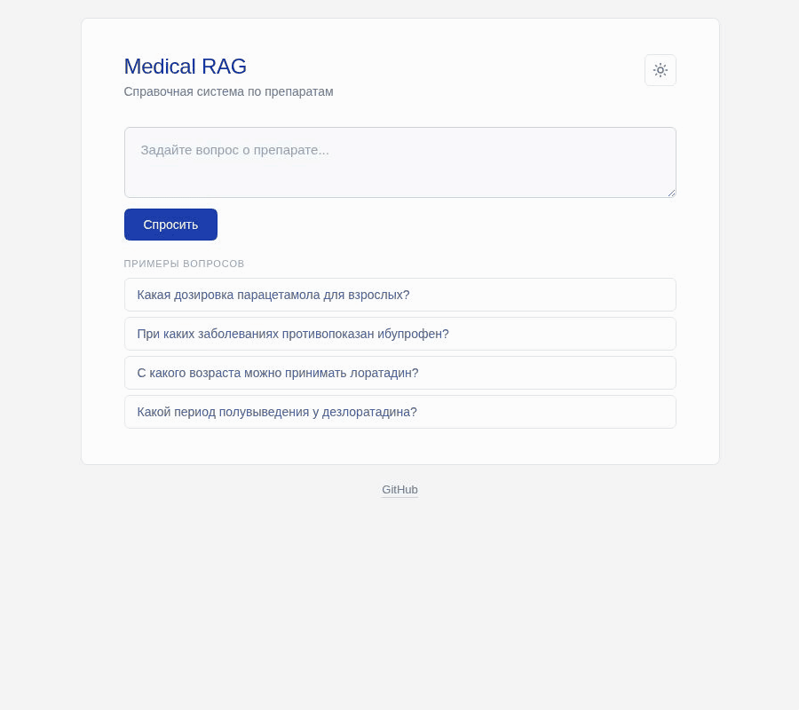

# Medical RAG (Russian)

A retrieval-augmented question-answering system over Russian-language drug instructions, with strict source citation and no-medical-advice guardrails.



## What it does

The user asks a question in Russian about a medication. The system retrieves the most semantically relevant chunks from a corpus of drug instructions, then generates an answer grounded strictly in those chunks, with the source cited and a mandatory disclaimer attached. When the retrieved context does not contain the answer, the system reports that honestly instead of hallucinating.

It is an information-retrieval tool, not a medical advisor.

## Engineering arc

This project documents a multi-stage engineering arc: scaling from 3 to 30 documents and 29 to 112 evaluation questions; evaluating and adopting section-aware chunking and hypothetical-questions ingest; evaluating and rejecting hybrid retrieval, HyDE, and contextual chunks based on measured negative results; building an LLM-as-judge scorer that revealed a generation prompt bug, which was fixed for a +6% answer-accuracy lift. Negative results and prompt iterations are preserved across branches. The engineering decisions are visible in the git history.

## Live demo

Deployment runbook in [`DEPLOY.md`](DEPLOY.md). Tested production deployment on Ubuntu 24.04 via Docker Compose, with Caddy reverse proxy and automatic Let's Encrypt HTTPS. The instance is not currently live to keep hosting costs at zero.

## Architecture

- **FastAPI** service exposing `/ask`, `/ask/stream`, and `/health` endpoints
- **pgvector** (PostgreSQL with vector extension) as the vector store and citation metadata store
- **multilingual-e5-small** sentence-transformer running locally for embeddings (384-dimensional)
- **bge-reranker-v2-m3** cross-encoder, lazy-loaded, used as an optional second-stage reranker
- **DeepSeek API** for generation (OpenAI-compatible)
- The full stack runs via **docker-compose** with one command
- A single-file static frontend (`static/index.html`) consumes `/ask/stream` via Server-Sent Events for token-by-token streaming, with markdown rendering, dark mode, and a clinical aesthetic. Vanilla HTML/CSS/JS, no build step.

Request flow:

```
user query
   │
   ▼
FastAPI /ask or /ask/stream
   │
   ▼
embed query (e5, "query:" prefix)
   │
   ▼
pgvector cosine similarity search → top-k candidates
   │
   ▼  (optional, enabled via "rerank": true)
cross-encoder rerank → top-10 by relevance
   │
   ▼
DeepSeek generation, grounded in retrieved chunks
   │
   ▼
cited answer + disclaimer
```

## Design decisions

**DeepSeek for generation.** OpenAI and several other Western LLM APIs are geoblocked in Russia. DeepSeek is accessible, OpenAI-compatible (so the standard `openai` Python client works), and cost-effective at this scale.

**pgvector over a dedicated vector database.** The corpus is ~1900 chunks across 30 documents, and every chunk needs to carry citation metadata (source document) alongside its embedding. Keeping vectors and relational metadata in a single Postgres table simplifies queries and removes a moving part. A dedicated vector DB like Qdrant would be the right migration target if the corpus grew significantly or required advanced filtering.

**Local embeddings instead of an embedding API.** `multilingual-e5-small` is ~470MB and runs on CPU. No paid embedding service is needed, there are no rate limits, and document text doesn't leave the local environment.

**`query:` / `passage:` prefixes on e5 inputs.** The multilingual-e5 family was trained with these prefixes; using them consistently at ingest and query time improves retrieval quality measurably. Discovered by reading the model card after a first pass without prefixes underperformed.

**RecursiveCharacterTextSplitter (structure-aware chunking).** An initial hand-written character-count chunker produced visible mid-word and mid-sentence cuts on Russian text, which degraded retrieval on factual passages. Switching to LangChain's RecursiveCharacterTextSplitter — which prefers paragraph and sentence boundaries before falling back to character cuts — improved chunk coherence and retrieval distance scores on the same queries.

**Section-aware chunking with drug-name prefixes.** Documents are parsed into their standard sections (Показания, Противопоказания, Способ применения и дозы, etc.) and each chunk is prefixed with `[Brand (active ingredient) — Section]`. This embeds drug identity and section context directly into every chunk vector, so a query like "противопоказания ибупрофена" or "с какого возраста принимать лоратадин" aligns with the prefix and pulls the right chunk.

**Cross-encoder reranking.** After scaling the corpus from 3 to 15 documents, baseline answer accuracy dropped because semantic neighbors crowd the right chunks at top-k. A cross-encoder reranker (bge-reranker-v2-m3) re-scores the top-50 bi-encoder candidates by reading query + chunk together, surfacing the actually-relevant passage. Toggled per-request via a `rerank` flag; default off due to substantial latency on CPU.

**Reranker lazy-loaded; HuggingFace cache mounted from host.** The cross-encoder model is ~2.27GB. Rather than baking it into the Docker image (tripling image size), it's loaded on first use and read from a host-mounted HuggingFace cache. The Docker image stays small; the model downloads once on the host and is reused across container restarts.

**`temperature=0` for generation and judging.** This is a factual-retrieval tool, not a creative one. Determinism is preferable to variety, and determinism in the judge means re-running the eval produces the same scores.

**Hypothetical questions at ingest.** For each chunk, DeepSeek generates 3 synthetic user-style questions which are embedded alongside the chunk text. This directly addresses the user-phrasing-to-document-phrasing gap that section-aware prefixing and contextual chunks could not. Particularly effective on numeric-fact lookups, where the chunk now carries "У какого препарата период полувыведения 27 часов?" as embedded text, sitting much closer to real user queries than the document text "T1/2 — 20–30 ч" does. Generated questions are cached in `hypothetical_questions.json` (committed) so re-ingest is deterministic and free of API calls.

**Generation prompt tuned via LLM-as-judge feedback.** LLM-as-judge analysis (see Evaluation) revealed that the system was over-refusing on class-discrimination and broad dosing questions where retrieval had succeeded — answering "нет в контексте" when the relevant chunks were present. A revised system prompt explicitly instructs the model to prefer partial-but-grounded answers over refusal, and to answer class questions by naming the relevant drug from context. This single change lifted answer accuracy from 89% to 95% on the 112-question eval with no retrieval changes.

## Safety properties

- Answers are constructed only from retrieved context, never from the model's training knowledge. This is enforced by the system prompt.
- Every answer cites its source document.
- Every answer ends with: «Это не медицинская консультация, обратитесь к врачу.»
- When the retrieved context does not contain the answer, the system says so explicitly. This behavior is verified by the evaluation set.

## Evaluation

The evaluation set (`data/drug_questions.json`) contains 112 Russian questions across the 30-drug corpus. Categories include single-drug factual lookup, symptom-based ambiguity ("что от боли в суставах"), active-substance queries (using ingredient name not brand), numeric-fact lookup (T1/2 values, percentages, age cutoffs), class-discrimination ("какой ингибитор АПФ"), cross-class confusion ("какой препарат снижает давление и замедляет ЧСС"), drug interactions, pregnancy/lactation, and refusal probes for out-of-scope questions.

Each question specifies an expected source document and a list of keyword stems that should appear in a correct answer. The eval script (`evaluate.py`) hits the running `/ask` endpoint and writes the results JSON.

The keyword scorer checks two things:

- **Retrieval accuracy (top-3):** does at least one chunk from the expected source appear in the top three retrieved chunks?
- **Answer accuracy:** does the generated answer contain at least one expected keyword stem **and** cite the expected source label?

Keyword matching uses stem fragments rather than full inflected forms to accommodate Russian morphology (e.g. `печеноч` matches `печеночная`, `печеночной`, `печеночному`). Dash and `ё`/`е` variants are normalized.

### Results — original 15-drug corpus, 64-question eval (no reranker)

| Configuration | Retrieval (top-3) | Answer accuracy |
|---|---|---|
| **Hypothetical questions** | **89% (57/64)** | **95% (61/64)** |
| Section-aware chunking | 87% (56/64) | 92% (59/64) |
| Section-aware + contextual chunks | 87% (56/64) | 92% (59/64) |
| Section-aware + hybrid retrieval | 87% (56/64) | 92% (59/64) |
| Old chunking | 89% (57/64) | 76% (49/64) |

Section-aware chunking was a substantial intermediate win (+16pp over old chunking). Hypothetical questions added a further +3pp on top of it. Hybrid retrieval and contextual chunks were evaluated and did not outperform section-aware alone — see Known limitations for diagnosis.

### Results — current 30-drug corpus, 112-question eval (no reranker)

| Configuration | Retrieval (top-3) | Answer accuracy |
|---|---|---|
| **Hypothetical questions, revised generation prompt (production)** | **91% (102/112)** | **95% (106/112)** |
| Hypothetical questions, prior generation prompt | 91% (102/112) | 89% (100/112) |

Doubling the corpus (15 → 30 drugs) and expanding the eval (64 → 112 questions, with deliberate coverage of class-discrimination and cross-class confusion) tested the system's scaling behavior. Retrieval held up well: 91% on the harder eval. Answer accuracy initially dropped to 89% — diagnosed via LLM-as-judge as a generation over-refusal pattern, then recovered to 95% via prompt revision.

### LLM-as-judge: a second-opinion scorer

Keyword-stem matching is fast and deterministic but has known brittleness — false negatives on character variants (en-dash vs hyphen, ё/е), inability to detect wrong-but-keyword-matching answers, and no way to reward correct refusals. To probe these gaps, an LLM-as-judge scorer (`judge.py`, DeepSeek with `temperature=0`) was added alongside the keyword scorer. The judge receives the retrieved context, the generated answer, and the expected sources/keywords, then returns structured judgments on three dimensions: correctness, faithfulness (is the answer actually grounded in the retrieved context, or did the model fabricate sources?), and refusal appropriateness.

Critically, the judge sees the retrieved context — not just the question and the answer. Without this, the judge tends to evaluate against its own training knowledge rather than against what the system was actually given. Passing the context grounds the judge's evaluation in the same evidence the system saw.

Comparing judge against keyword scoring on the 112-question eval surfaced three findings:

1. **Keyword false positives** — answers that contained the expected keyword but were factually wrong or fabricated their source. Keyword scoring counted these as passing; judge caught them.

2. **A real generation bug** — the system was over-refusing on questions where retrieval had succeeded, particularly class-discrimination questions ("какой ингибитор АПФ") and broad dosing questions ("какая дозировка лозартана"). The retrieved chunks contained the answer; the generation prompt was rejecting them as "ambiguous." A targeted prompt revision lifted answer accuracy from 89% to 95% without any retrieval changes.

3. **An inferential-leap pattern** — the system sometimes states facts that aren't directly written in the retrieved context but can be inferred from related statements (e.g., concluding a drug belongs to a class because the document mentions interactions with that class). Fixing this would require stricter grounding instructions, which would likely re-introduce over-refusal. Documented as an accepted tradeoff.

Judge results on the production system: 97% correctness, 97% faithfulness, 96% refusal-appropriateness on 112 questions.

## Known limitations / Future work

- **Reranker latency.** Substantial on CPU, acceptable for evaluation but not for interactive use. Production deployment would require GPU inference or a lighter reranker.

- **Inferential leaps from context.** The system sometimes states facts that follow inferentially from the retrieved context rather than being directly stated in it. Stricter grounding would re-introduce the over-refusal pattern. Current generation prompt accepts this tradeoff in favor of usefulness.

- **General-purpose generation model.** `deepseek-v4-flash` is not medically tuned. Real medical use would require a domain-tuned model and clinical review.

- **Retrieval is based on textual similarity.** Queries phrased in terms not used by the source document (e.g., asking by age when the source dosing is by weight) may fail to retrieve relevant chunks.

- **Rare-numeric-fact retrieval remains weak.** Queries like "у какого препарата период полувыведения 27 часов" lose to semantic neighbors because numbers carry weak embedding signal. Hybrid retrieval and HyDE were both evaluated and rejected (see below). The principled fix would be structured metadata extraction at ingest time (parsing "T1/2 — 27 ч" into a queryable numeric field), out of scope for this prototype.

- **Hybrid retrieval was evaluated and did not improve accuracy.** A BM25 keyword-search stage (Postgres tsvector + RRF merge with vector search) was implemented as a candidate fix for queries on specific numeric facts. On the eval set, hybrid produced no measurable lift over section-aware chunking alone. The diagnosis: natural-language Russian queries ("период полувыведения около 27 часов") rarely share enough exact tokens with stemmed chunks ("T1/2 — 20–30 ч") for BM25 to surface the right answer, while RRF still pulls ranking toward low-quality BM25 matches. Implementation preserved on the `hybrid-retrieval` branch.

- **HyDE evaluated by simulation, not implemented.** Hypothetical Document Embeddings were tested by hand-simulating LLM-rewritten queries against the corpus. The hypothetical answers failed to surface correct chunks for reverse-lookup numeric queries, indicating the failure mode is not a phrasing gap (which HyDE addresses) but a rare-fact problem — specific numbers in a single chunk cannot compete in embedding space against the broader semantic neighborhood.

- **Contextual chunks (Anthropic-style) evaluated, no lift.** Generating per-chunk LLM context and embedding it alongside chunk text matched section-aware chunking but did not exceed it. Diagnosis: section-aware prefixes already encode most of what cheap contextualization would add. Implementation preserved on the `contextual-chunks` branch.

## Running it

### Prerequisites

- Docker Desktop
- A DeepSeek API key (https://platform.deepseek.com)

### Setup

1. Clone the repository.
2. Copy `.env.example` to `.env` and fill in the values.
3. Bring up the stack:

   ```bash
   docker compose up --build
   ```

4. In a separate terminal, ingest the documents:

   ```bash
   docker compose exec app python ingest.py
   ```

5. Open the frontend at `http://localhost:8000` or the interactive API docs at `http://localhost:8000/docs`.

### Running the evaluation

With the stack running, from the host:

```bash
python evaluate.py
```

The script runs with rerank off (toggle by setting `rerank: true` in the request payload) and writes the per-question results plus both keyword and judge aggregates to the terminal.

Note: the first rerank-enabled run on a clean host will download the cross-encoder model (~2.27GB) into the local HuggingFace cache. Subsequent runs reuse it.

## Project structure

```
├── app.py                       # FastAPI service: /ask, /ask/stream, /health
├── ingest.py                    # Chunks, embeds, stores chunks + hypothetical questions
├── hypotheticals.py             # Generates synthetic questions per chunk (used by ingest)
├── judge.py                     # LLM-as-judge scorer
├── evaluate.py                  # Runs eval set against /ask with both keyword and judge scoring
├── hypothetical_questions.json  # Cached LLM-generated questions (committed for reproducibility)
├── scripts/
│   ├── search.py                # Script for inspecting retrieval
│   └── rebuild_questions_cache.py  # Recovers the questions cache from DB chunks
├── data/
│   ├── drugs/                   # 30 Russian drug instructions (.txt)
│   ├── drug_questions.json      # Evaluation set (112 questions)
│   └── sources.md               # Names and sources of the drugs
├── static/
│   └── index.html               # Streaming frontend (vanilla HTML/CSS/JS, dark mode)
├── DEPLOY.md                    # Deployment runbook
├── Dockerfile                   # App container definition
├── docker-compose.yml           # Full stack: app + pgvector (+ Caddy in deployment)
├── requirements.txt             # Direct Python dependencies
├── .env.example                 # Template for environment variables
└── README.md
```

## Branches

- `main` — production state (section-aware chunking + hypothetical questions + revised generation prompt + LLM-as-judge scorer)
- `hybrid-retrieval` — BM25 hybrid retrieval, evaluated and rejected (see Known limitations)
- `contextual-chunks` — Anthropic-style contextual chunks, evaluated and not adopted

## Tech stack

Python 3.12, FastAPI, Uvicorn, pgvector, sentence-transformers, LangChain text splitters, psycopg2, OpenAI Python client (for DeepSeek), Docker, Caddy (deployment), DeepSeek API.
